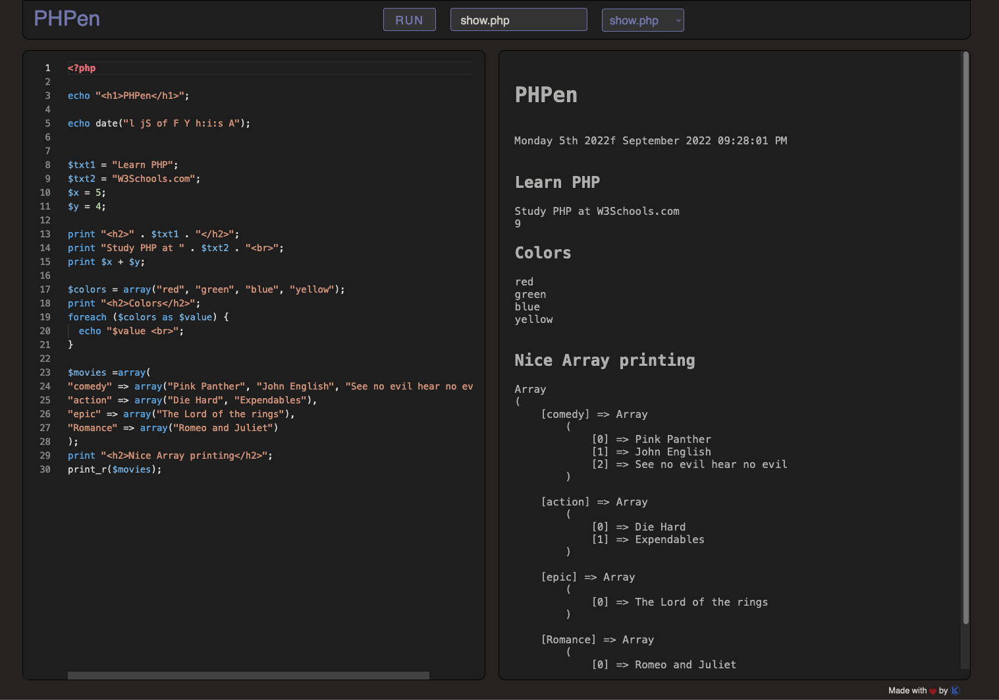

# PHPen

**It is what it sounds like, a PHP variant of CodePen.**

## Functions
- Write any PHP code in the editor on the left, click `RUN` or `control` + `Enter`.
- Save your code by simply writing a name in the text field above.
- Load existing scripts using the dropdown menu.

## Technical

The content of the code editor is written to a PHP file and displayed in the iframe on the right.   
**It's that simple :-)**   
The rest is a bit of javascript to enable linking, saving and loading files.

